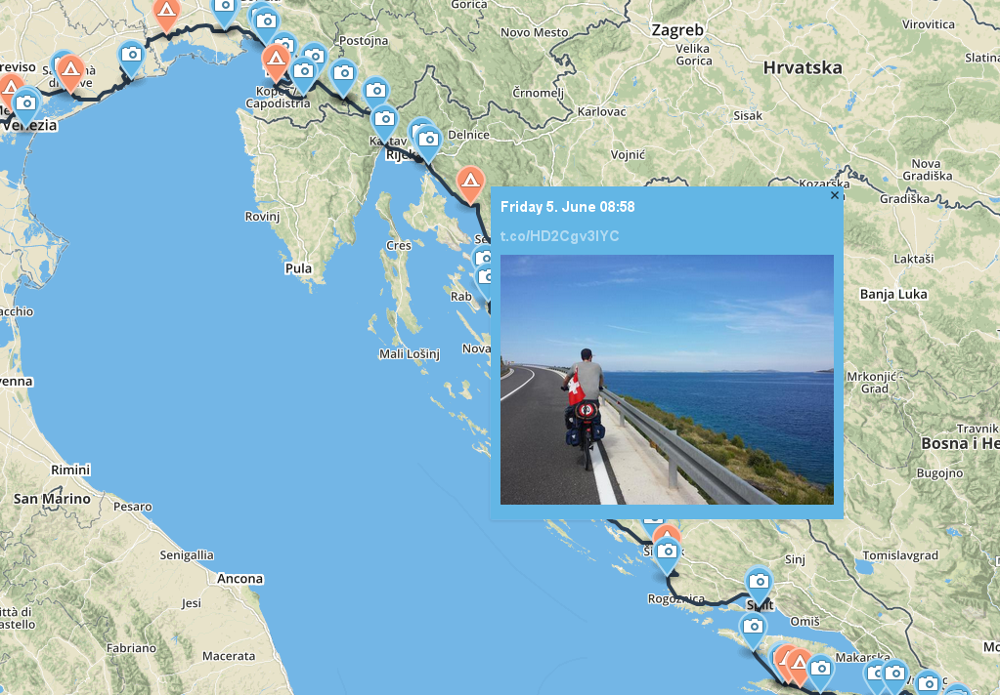

# My Biketour from Switzerland to Greece

This was hacked together in a day to provide updates about my biketour from Switzerland to Greece to my friends and familiy.
It was originally a Django application which provided realtime tracking but has now been replaced with a completely static
site with the resulting GeoJSON data.

You can read the accompanying [blog post about creating a T-Shirt from GPX data](http://lukasmartinelli.ch/gis/2015/09/27/create-tshirt-with-mapbox-studio.html).

